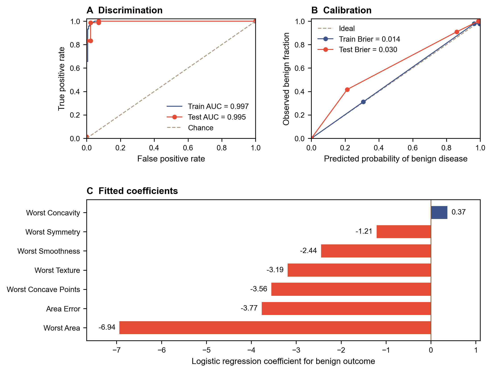
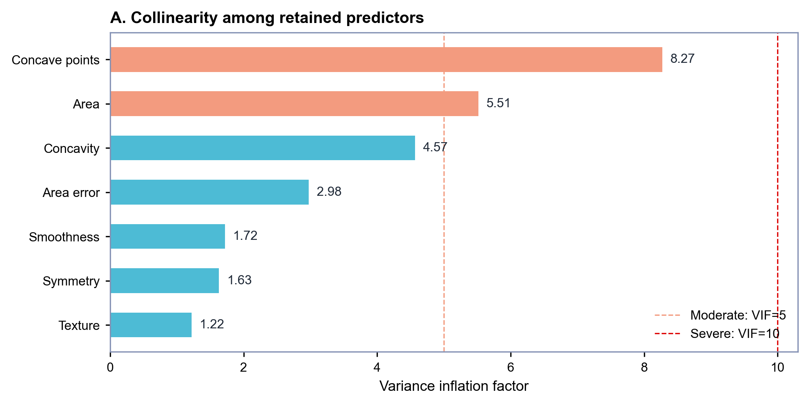

# Breast Cancer Diagnosis Command Center

An interactive [Shiny for Python](https://shiny.posit.co/py/) dashboard for transparent breast cancer classification with a two-stage LASSO and logistic regression workflow.

[Open the live application](https://medictio.shinyapps.io/breast-cancer-classifier/)

> [!WARNING]
> This project is intended for research, education, and software demonstration only. It is not a medical device, has not been externally validated, and must not be used to diagnose patients or guide treatment.

## Overview

The application uses the [Wisconsin Diagnostic Breast Cancer dataset](https://archive.ics.uci.edu/dataset/17/breast-cancer-wisconsin-diagnostic), distributed through `sklearn.datasets.load_breast_cancer`. The dataset contains 569 samples and 30 continuous measurements derived from digitized fine-needle aspirate images of breast masses.

The dashboard provides:

- single-case prediction with editable feature values;
- explicit malignant and benign probabilities;
- batch CSV scoring and export;
- an interactive decision-threshold laboratory;
- train/test ROC, calibration, and classification metrics;
- LASSO paths, selected coefficients, linearity checks, and VIF diagnostics;
- a global visitor map with aggregate usage statistics; and
- a deployment-safe precomputed model bundle without raw feature matrices.

## Model workflow

```text
Wisconsin Diagnostic Breast Cancer data (n = 569, 30 features)
                         |
             80/20 stratified split
                random seed = 42
                         |
        RobustScaler fitted on training data only
                         |
       L1 logistic regression, 5-fold CV by AUC
          lambda-1SE rule for feature selection
                         |
              7 retained predictors
                         |
     Unpenalized logistic regression refit on the
       scaled training data using those predictors
                         |
       Saved bundle -> Shiny prediction dashboard
```

The tracked bundle was fitted on 455 training observations and evaluated on 114 held-out observations. Scaling, cross-validation, feature selection, and coefficient estimation use the training split only.

### Selected predictors

The current `bc_bundle.pkl` retains seven of the original 30 predictors:

1. `area error`
2. `worst texture`
3. `worst area`
4. `worst smoothness`
5. `worst concavity`
6. `worst concave points`
7. `worst symmetry`

All inputs must use the units and definitions of the original Wisconsin Diagnostic Breast Cancer dataset.

## Probability semantics

The class encoding is important:

| Encoded class | Meaning |
|---:|---|
| `0` | Malignant |
| `1` | Benign |

Consequently, `pipe_lr.predict_proba(X)[:, 1]` is `P(benign)`. The application reports malignancy probability as:

```python
p_benign = pipe_lr.predict_proba(X)[:, 1]
p_malignant = 1.0 - p_benign
```

At the default threshold, a case is classified as malignant when `P(malignant) >= 0.50`. The Threshold Lab allows this operating cutoff to be explored interactively.

## Current bundle performance

The following values describe the checked-in bundle and its fixed 80/20 split. They are not estimates of performance in a new clinical population.

| Metric | Train | Test |
|---|---:|---:|
| ROC AUC | 0.997 | 0.995 |
| Brier score | 0.014 | 0.030 |

Test-set classification at `P(malignant) >= 0.50`:

| Metric | Value |
|---|---:|
| Accuracy | 0.947 |
| Sensitivity for malignancy | 0.976 |
| Specificity for benign cases | 0.931 |
| Positive predictive value | 0.891 |
| Negative predictive value | 0.985 |
| F1 score for malignancy | 0.932 |

The test-set confusion matrix contains 41 true positives, 67 true negatives, 5 false positives, and 1 false negative when malignancy is treated as the positive class. The test Brier score is 0.030 versus 0.233 for the training-prevalence null model. The Hosmer-Lemeshow result is chi-square = 3.37 with 8 degrees of freedom and `p = 0.909`; this does not provide evidence of lack of fit in this small held-out sample.

### Model evaluation figures

The figures below are rendered from the checked-in `bc_bundle.pkl`, so they correspond to the same fixed train/test split and fitted model reported above.

#### Discrimination, calibration, and fitted coefficients

Panel A compares the train and held-out test ROC curves. Panel B shows train/test calibration and Brier scores. Panel C shows the fitted logistic-regression coefficients after robust scaling; positive coefficients increase `P(benign)`, whereas negative coefficients increase `P(malignant)`.



#### LASSO feature selection

Panel A shows the regularisation paths, and Panel B shows the five-fold cross-validation AUC used by the lambda-1SE selection rule.


#### Functional-form diagnostics

Empirical training-set log-odds are shown for each retained predictor. The spline-versus-linear likelihood-ratio tests flag `worst texture` and `worst concavity` as non-linear at `alpha = 0.10`.


#### Collinearity diagnostics

Variance inflation factors are shown for the seven retained predictors, with reference lines at VIF 5 and VIF 10.



## Run locally

Python 3.11 or newer is recommended.

```bash
git clone https://github.com/MUQING-create/breast-cancer-risk-app.git
cd breast-cancer-risk-app

python -m venv .venv
```

Activate the environment:

```powershell
# Windows PowerShell
.venv\Scripts\Activate.ps1
```

```bash
# macOS or Linux
source .venv/bin/activate
```

Install the runtime dependencies and start the app:

```bash
python -m pip install --upgrade pip
python -m pip install -r requirements.txt
shiny run --reload app.py
```

Open the local URL printed by Shiny, normally `http://127.0.0.1:8000`.

The app loads `bc_bundle.pkl` at startup. Keep that file beside `breast_cancer_app.py` when packaging or deploying the application.

## Batch prediction

Upload a CSV containing all seven retained feature columns. Additional columns are preserved in the downloaded result.

```csv
area error,worst texture,worst area,worst smoothness,worst concavity,worst concave points,worst symmetry
```

The exported file appends:

- `P_malignant`
- `P_benign`
- `Prediction`

Column names are case-sensitive. The current interface verifies required columns but does not replace clinical data validation; users remain responsible for checking units, plausible ranges, missing values, and data provenance.

## Deployment

The repository includes a shinyapps.io deployment helper:

```bash
python -m pip install rsconnect-python
python deploy.py
```

Configure `rsconnect` credentials before running the helper. It deploys the application as `medictio/breast-cancer-classifier` and includes the precomputed bundle.

For any alternative container or hosting workflow, package at least:

- `app.py`
- `breast_cancer_app.py`
- `bc_bundle.pkl`
- `requirements.txt`
- `world.geojson` if the visitor map is enabled

Do not replace the deployment bundle with raw training records. The tracked bundle contains fitted estimators, preprocessing statistics, predictions, outcome labels, metrics, and plot data, but no `X_train`, `X_test`, or full patient-level feature table.

## Optional visitor analytics

The dashboard can render aggregate visit statistics through Supabase and locate public IP addresses through IPinfo or the `ipwho.is` fallback. Hosted visitors should be aware that country, city, latitude, and longitude may be recorded for this map.

The application code does not persist prediction form values or uploaded CSV contents. Analytics settings can be overridden with:

| Environment variable | Purpose |
|---|---|
| `IPINFO_TOKEN` | Optional authenticated IPinfo lookup |
| `SUPABASE_URL` | Supabase project URL |
| `SUPABASE_KEY` | Supabase client key; access should be restricted with row-level security |

## Repository layout

```text
.
|-- app.py                 # Minimal Shiny entry point
|-- breast_cancer_app.py   # Model loading, UI, server, plots, and analytics
|-- bc_bundle.pkl          # Precomputed model and evaluation bundle
|-- assets/                # Model evaluation figures used in this README
|-- requirements.txt       # Runtime dependencies
|-- deploy.py              # shinyapps.io deployment helper
|-- Dockerfile             # Container definition
|-- upload.py              # Hugging Face Space upload helper
`-- world.geojson          # Basemap used by visitor analytics
```

## Limitations

- The model is trained on a small, classic benchmark dataset rather than a contemporary prospective cohort.
- Performance is reported from one stratified holdout split; there is no nested validation, external validation, temporal validation, or site-level validation.
- The dataset does not represent the full clinical diagnostic pathway, prevalence, spectrum of disease, acquisition variability, or downstream consequences of errors.
- The saved diagnostics flag non-linearity at `alpha = 0.10` for `worst texture` and `worst concavity`; the deployed final model nevertheless enters all seven predictors linearly.
- VIF is moderate for `worst area` and `worst concave points`, so individual coefficient interpretations should remain cautious.
- The default threshold is illustrative and has not been selected from clinical costs, decision-curve analysis, or a prespecified deployment population.

## Data attribution

Wolberg, W., Mangasarian, O., Street, N., and Street, W. (1993). *Breast Cancer Wisconsin (Diagnostic)* [Dataset]. UCI Machine Learning Repository. [https://doi.org/10.24432/C5DW2B](https://doi.org/10.24432/C5DW2B)

The scikit-learn loader is documented at [`sklearn.datasets.load_breast_cancer`](https://scikit-learn.org/stable/modules/generated/sklearn.datasets.load_breast_cancer.html).
