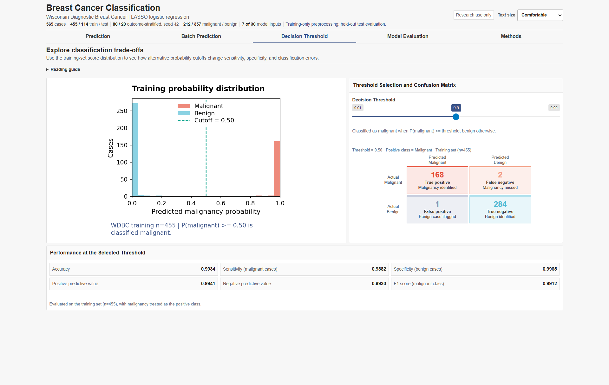
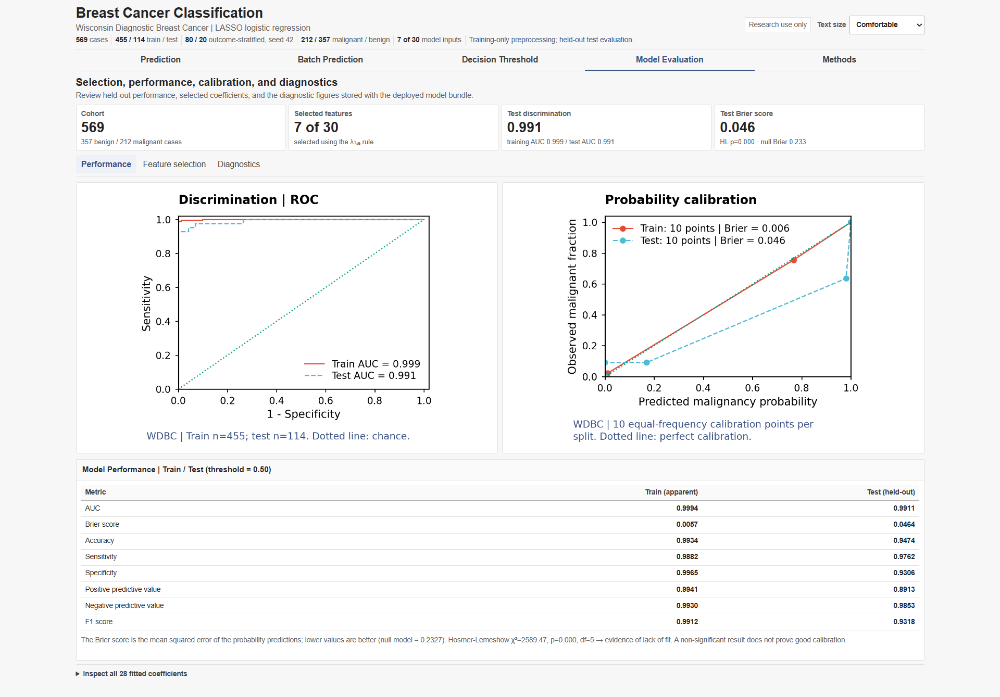
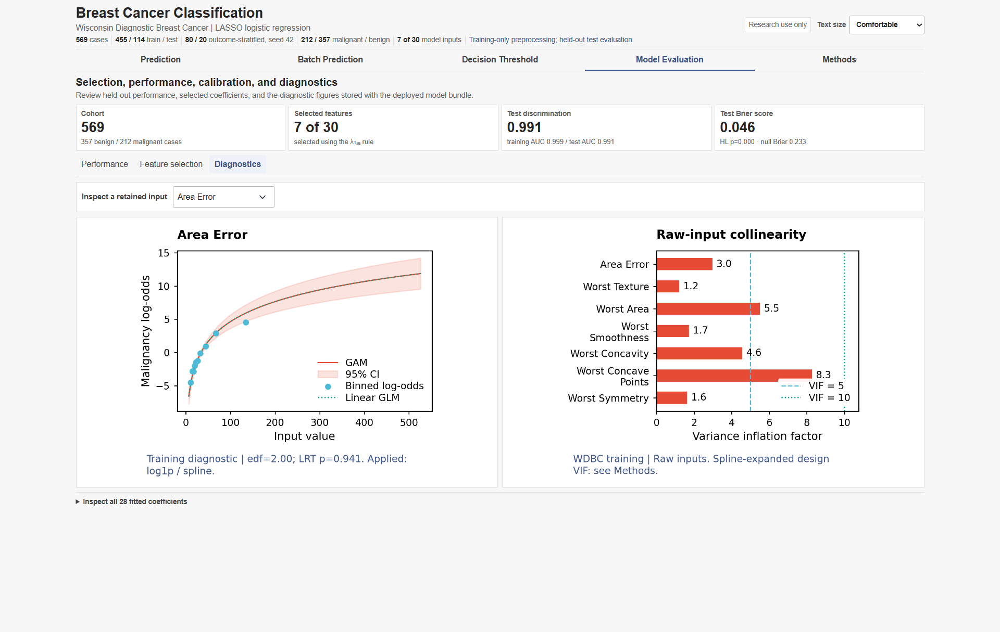
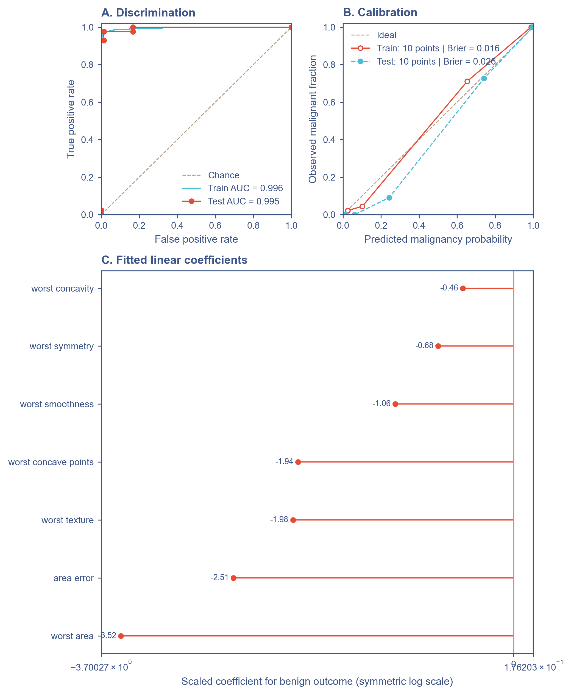
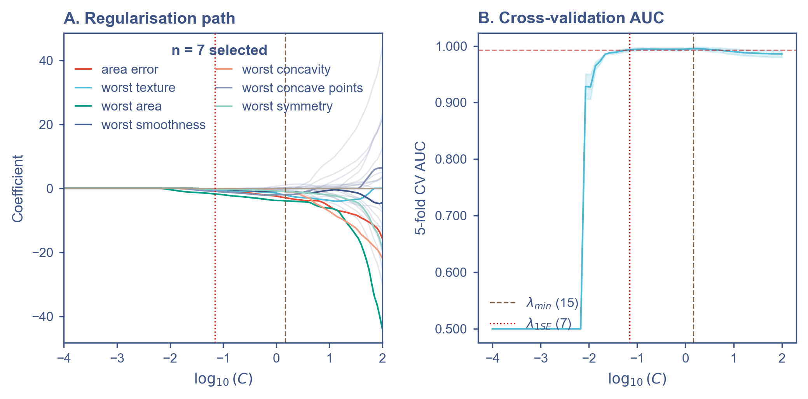
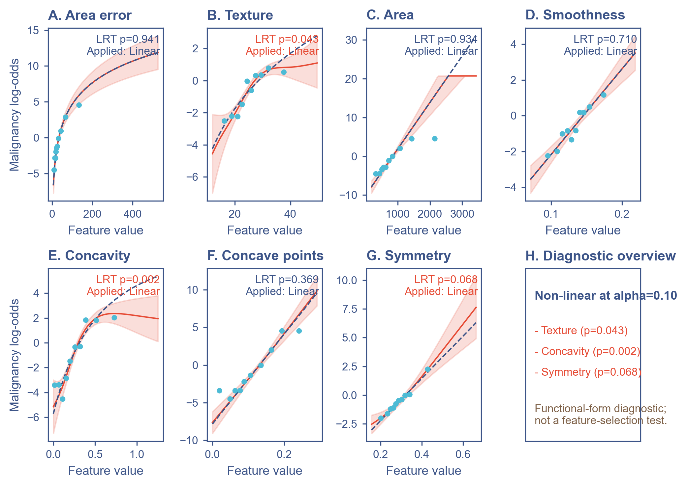
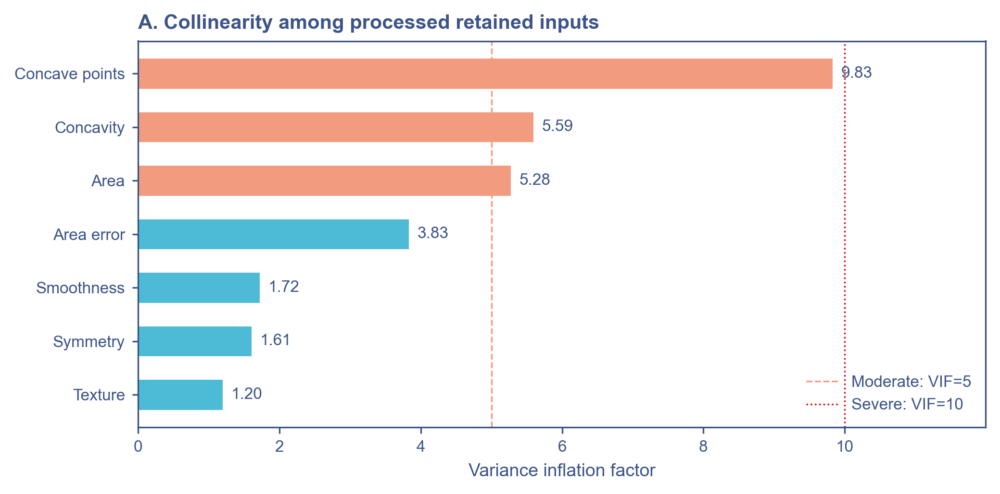

# Breast Cancer Classification Dashboard

An interactive [Shiny for Python](https://shiny.posit.co/py/) dashboard for breast cancer classification using a two-stage LASSO and L2-regularized logistic-regression workflow.

[Open the live application](https://medictio.shinyapps.io/breast-cancer-classifier/)

> [!WARNING]
> This project is intended for research, education, and software demonstration only. It is not a medical device, has not been externally validated, and must not be used to diagnose patients or guide treatment.

## Application preview

| Individual prediction | Decision-threshold analysis |
|---|---|
| [](docs/assets/breast_cancer_app.png) | [](docs/assets/breast_cancer_threshold.png) |
| Model performance and calibration | Functional-form and collinearity diagnostics |
| [](docs/assets/breast_cancer_evaluation.png) | [](docs/assets/breast_cancer_diagnostics.png) |

## Overview

The application uses the [Wisconsin Diagnostic Breast Cancer dataset](https://archive.ics.uci.edu/dataset/17/breast-cancer-wisconsin-diagnostic), distributed through `sklearn.datasets.load_breast_cancer`. The dataset contains 569 samples and 30 continuous measurements derived from digitized fine-needle aspirate images of breast masses.

The dashboard provides:

- single-case prediction with editable feature values;
- estimated probabilities for the malignant and benign classes;
- batch CSV scoring and export;
- interactive decision-threshold analysis;
- train/test ROC, calibration, and classification metrics;
- LASSO paths, selected coefficients, linearity checks, and VIF diagnostics;
- a global visitor map with aggregate usage statistics; and
- a deployment-safe precomputed model bundle without raw feature matrices.

## Model workflow

```text
Wisconsin Diagnostic Breast Cancer data (n = 569, 30 features)
                         |
             80/20 stratified split
                random seed = 42
                         |
        RobustScaler fitted on training data only
                         |
       L1 logistic regression, 5-fold CV by AUC
          lambda-1SE rule for feature selection
                         |
              7 retained predictors
                         |
     Training-only preprocessing transformations
          7 linear design terms from the 7 inputs
                         |
        Fold-local design preprocessing and L2-regularized logistic refit
                         |
       Saved bundle -> Shiny prediction dashboard
```

The tracked bundle was fitted on 455 training observations and evaluated on 114 held-out observations. RobustScaler and all preprocessing transformations are fitted on the training split only. The final model uses the processed inputs as linear terms; L2 regularization is selected by training-only cross-validation.

`area error` and `worst texture` use `log1p`; `worst concavity` uses Yeo-Johnson; the remaining retained inputs use their original scale. These seven processed inputs enter the final model as seven linear terms. GAM smooth p-values and LRT results are retained as diagnostics only and do not add nonlinear terms.

### Selected predictors

The current `breast_cancer_model_bundle.pkl` retains seven of the original 30 predictors:

1. `area error`
2. `worst texture`
3. `worst area`
4. `worst smoothness`
5. `worst concavity`
6. `worst concave points`
7. `worst symmetry`

All inputs must use the units and definitions of the original Wisconsin Diagnostic Breast Cancer dataset.

## Probability semantics

The class encoding is important:

| Encoded class | Meaning |
|---:|---|
| `0` | Malignant |
| `1` | Benign |

Consequently, `pipe_lr.predict_proba(X)[:, 1]` is `P(benign)`. The application reports malignancy probability as:

```python
p_benign = pipe_lr.predict_proba(X)[:, 1]
p_malignant = 1.0 - p_benign
```

At the default threshold, a case is classified as malignant when `P(malignant) >= 0.4438`. This cutoff is selected by the Youden index on training-set predictions only and then locked before test evaluation. The Decision Threshold tab allows alternative operating cutoffs to be explored interactively.

## Current bundle performance

The following values describe the current deployment bundle and its fixed 80/20 split. The canonical machine-readable source is `03_model_training_and_evaluation/.cache/training/training_metrics.json`; the bundle and this README are regenerated from the same training run. These values are not estimates of performance in a new clinical population.

| Metric | Train | Test |
|---|---:|---:|
| ROC AUC | 0.996 | 0.995 |
| Brier score | 0.0165 | 0.0257 |
| Accuracy at Youden threshold 0.4438 | 0.985 | 0.974 |

Test-set classification at the locked Youden threshold `P(malignant) >= 0.4438`:

| Metric | Value |
|---|---:|
| Accuracy | 0.974 |
| Sensitivity for malignancy | 0.976 |
| Specificity for benign cases | 0.972 |
| Positive predictive value | 0.953 |
| Negative predictive value | 0.986 |
| F1 score for malignancy | 0.965 |

The test-set confusion matrix contains 41 true positives, 70 true negatives, 2 false positives, and 1 false negative when malignancy is treated as the positive class. The Youden threshold changes the training classification metrics relative to the fixed 0.50 baseline but leaves all test classifications unchanged for this split. The test Brier score is 0.0257 versus 0.2327 for the training-prevalence null model. The grouped Hosmer-Lemeshow statistic is 1.86 with 8 degrees of freedom and `p = 0.985`; this result does not prove good calibration, so the Brier score and calibration curve remain the primary checks. The test set was not used to select the threshold.

| Decision rule | Threshold | Train accuracy | Test accuracy | Test sensitivity | Test specificity | Test F1 |
|---|---:|---:|---:|---:|---:|---:|
| Youden index, training-locked | 0.4438 | 0.985 | 0.974 | 0.976 | 0.972 | 0.965 |
| Fixed reference threshold | 0.5000 | 0.982 | 0.974 | 0.976 | 0.972 | 0.965 |

### Repeated validation audit

The deployment pipeline is also evaluated with 5-fold stratified cross-validation repeated 10 times. Preprocessing is refit inside every fold, while the seven-feature set and final regularization settings remain fixed to the deployment bundle. A separate Youden threshold is selected inside each training fold and locked before scoring that fold. This is a conditional validation of the deployed model, not a replacement for nested feature-selection validation or external validation.

The generated report is `03_model_training_and_evaluation/.cache/training/repeated_cv_metrics.json`. It contains fold variability, patient-level bootstrap 95% confidence intervals, and fixed-penalty LASSO feature-selection frequencies. The audit can be regenerated with:

```bash
python 03_model_training_and_evaluation/repeated_validation.py
```

The pooled repeated-validation estimates are:

| Metric | Estimate | Bootstrap 95% CI |
|---|---:|---:|
| ROC AUC | 0.994 | 0.988-0.999 |
| PR AUC | 0.993 | 0.986-0.998 |
| Brier score | 0.0206 | 0.0140-0.0288 |
| Calibration intercept | 0.246 | -0.262-0.854 |
| Calibration slope | 1.347 | 1.034-2.237 |
| Accuracy at 0.50 | 0.975 | 0.961-0.986 |
| Sensitivity for malignancy | 0.948 | 0.915-0.976 |
| Specificity for benign cases | 0.992 | 0.981-1.000 |
| F1 score for malignancy | 0.966 | 0.946-0.981 |

Using the fold-local Youden thresholds, the mean threshold was 0.431 (range 0.339-0.524). Aggregating the repeated fold decisions at patient level gave accuracy 0.979, sensitivity 0.967, specificity 0.986, and F1 score 0.972. These threshold metrics are reported without a bootstrap interval because the threshold is re-estimated inside each validation fold.

### Comparison with published WDBC results

The closest protocol match is a 2026 leakage-controlled study that also used repeated stratified 5-fold cross-validation with 10 repeats. Its HistGradientBoosting model reported ROC-AUC 0.9933, PR-AUC 0.9915, sensitivity 0.9670, specificity 0.9664, and Brier score 0.0228. The present model has similar discrimination and Brier score, with a more conservative Youden operating point that gives higher specificity.

| Result | Validation | ROC-AUC | PR-AUC | Accuracy | Sensitivity | Specificity | Brier |
|---|---|---:|---:|---:|---:|---:|---:|
| Current model, fold-local Youden | 5-fold x 10 repeats | 0.9944 | 0.9932 | 0.9789 | 0.9670 | 0.9860 | 0.0206 |
| HistGradientBoosting, [NRFHH 2026](https://www.nrfhh.com/index.php/journal/article/view/397) | 5-fold x 10 repeats | 0.9933 | 0.9915 | - | 0.9670 | 0.9664 | 0.0228 |
| Elastic Net, [PLOS One 2026](https://pmc.ncbi.nlm.nih.gov/articles/PMC13412056/) | 80/20 holdout, Youden threshold | 0.999 | - | 0.991 | 1.000 | 0.986 | 0.012 |
| Logistic regression, [PeerJ 2025](https://pubmed.ncbi.nlm.nih.gov/40567684/) | WDBC benchmark | - | - | 0.975 | - | - | - |
| RFE+GWO+MLP, [PLOS One 2024](https://journals.plos.org/plosone/article?id=10.1371/journal.pone.0304768) | WDBC benchmark | 0.982 | - | 0.9825 | 0.9906 | 0.9692 | - |

These comparisons are directional rather than a formal ranking: the studies use different splits, threshold rules, feature-selection procedures, and model families. The published Elastic-Net result is the strongest raw benchmark in this table, whereas the present model provides a compact seven-feature linear model with explicit training-only threshold selection and repeated-validation auditing.

At the fixed LASSO penalty used for the deployment feature-selection stage, `area error`, `worst texture`, `worst smoothness`, `worst concave points`, and `worst symmetry` were selected in all 50 training folds. `worst area` and `worst concavity` were selected in 94% and 86% of folds, respectively. The repeated-validation results should be used as the more stable generalization estimate; the fixed holdout remains useful for the deployment-specific audit trail.

### Model evaluation figures

The figures below are rendered from the checked-in `04_model_deployment/breast_cancer_model_bundle.pkl`, so they correspond to the same fixed train/test split and fitted model reported above. They use the shared Cell red/blue/teal palette with navy typography and can be regenerated with `python docs/generate_readme_figures.py`.

#### Discrimination, calibration, and fitted coefficients

Panel A compares the train and held-out test ROC curves. Panel B shows malignancy calibration using 10 equal-frequency groups per split together with Brier scores; coincident estimates may overlap. Panel C shows the seven regularized linear coefficients after robust scaling.



#### LASSO feature selection

Panel A shows the regularization paths, and Panel B shows the five-fold cross-validation AUC used by the lambda-1SE selection rule.



#### Functional-form diagnostics

Empirical training-set log-odds, GAM curves with 95% intervals, and linear references are shown for each retained predictor as diagnostics. On the selected transformation scale, LRTs flag `worst texture`, `worst concavity`, and `worst symmetry` at `alpha = 0.10`, but the final fitted model remains linear by specification.



#### Collinearity diagnostics

Variance inflation factors are shown for the seven processed retained inputs, with reference lines at VIF 5 and VIF 10. The application Methods table reports VIF for the seven linear design terms.



## Run locally

Use Python 3.13 (the bundles and deployment use Python 3.13.9).

```bash
git clone https://github.com/MUQING-research/breast-cancer-risk-app.git
cd breast-cancer-risk-app

python -m venv .venv
```

Activate the environment:

```powershell
# Windows PowerShell
.venv\Scripts\Activate.ps1
```

```bash
# macOS or Linux
source .venv/bin/activate
```

Install the runtime dependencies and start the app:

```bash
python -m pip install --upgrade pip
python -m pip install -r 04_model_deployment/requirements.txt
shiny run --reload 04_model_deployment/app.py
```

Open the local URL printed by Shiny, normally `http://127.0.0.1:8000`.

The app loads `04_model_deployment/breast_cancer_model_bundle.pkl` at startup. The `04_model_deployment/` directory is the self-contained deployment package.

For the offline pipeline, install `03_model_training_and_evaluation/requirements.txt`, run `python 01_data_cleaning/clean_dataset.py`, then run `python 03_model_training_and_evaluation/train_and_export_model_bundle.py`. The pipeline exports the cleaned table, dictionary, diagnostic PNGs, design matrices, decision log, and canonical `training_metrics.json` into `03_model_training_and_evaluation/.cache/training/`. Run `python 03_model_training_and_evaluation/repeated_validation.py` for the repeated-validation audit. These local row-level exports are excluded from deployment and Git. Reproduce model and UI checks with `python -m unittest discover -s 03_model_training_and_evaluation -p "test_*.py" -v`.

## Batch prediction

Upload a CSV containing all seven retained feature columns. Additional columns are preserved in the downloaded result.

```csv
area error,worst texture,worst area,worst smoothness,worst concavity,worst concave points,worst symmetry
```

The exported file appends:

- `P_malignant`
- `P_benign`
- `Prediction`

Column names are case-sensitive. The interface checks required columns, numeric types, finite values, non-negative measurements, and empty uploads. Users must still verify measurement units and data provenance.

## Deployment

The repository includes a shinyapps.io deployment helper:

```bash
python -m pip install rsconnect-python
python 04_model_deployment/deploy.py
```

Configure `rsconnect` credentials before running the helper from the Python 3.13 environment matching `04_model_deployment/requirements.txt`. Run `python 04_model_deployment/deploy.py --check` for a local preflight. The helper updates the existing `medictio/breast-cancer-classifier` app, checks pinned package versions, and uploads only the runtime file allowlist from `04_model_deployment/`; training, tests, docs, and GitHub helpers are excluded.

Keep shinyapps.io's package cache enabled so unchanged runtime dependencies are reused between deployments.

For any alternative container or hosting workflow, package at least:

- `04_model_deployment/app.py`
- `04_model_deployment/breast_cancer_app.py`
- `04_model_deployment/breast_cancer_model_bundle.pkl`
- `04_model_deployment/preprocessing_decisions.json`
- `04_model_deployment/requirements.txt`
- `04_model_deployment/compact_theme.css`
- `04_model_deployment/world.geojson` if the visitor map is enabled

Do not replace the deployment bundle with raw training records. The tracked bundle contains fitted estimators, preprocessing statistics, predictions, outcome labels, metrics, and plot data, but no `X_train`, `X_test`, or full patient-level feature table.

## Optional visitor analytics

The dashboard can optionally render aggregate visit statistics through Supabase and locate public IP addresses through IPinfo or the `ipwho.is` fallback. Remote persistence requires both `SUPABASE_URL` and `SUPABASE_KEY`; without them, the app uses a bounded process-local visit list that resets on restart. Hosted visitors should be informed when location lookup is enabled.

The shinyapps.io deployment helper does not forward environment variables: that platform does not support `rsconnect --environment` management. Container hosts can inject the variables below. See the [Posit deployment documentation](https://docs.posit.co/rsconnect-python/deploying/).

The application code does not persist prediction form values or uploaded CSV contents. Analytics settings are supplied through environment variables:

| Environment variable | Purpose |
|---|---|
| `IPINFO_TOKEN` | Optional authenticated IPinfo lookup |
| `SUPABASE_URL` | Supabase project URL |
| `SUPABASE_KEY` | Supabase client key; access should be restricted with row-level security |

## Repository layout

```text
.
|-- 01_data_cleaning/     # Source-level cleaning and data audit
|   `-- clean_dataset.py
|-- 02_data_preprocessing/ # Training-only EDA and preprocessing
|   `-- eda_and_preprocessing.py
|-- 03_model_training_and_evaluation/ # Model training, test-set evaluation, and checks
|   |-- train_and_export_model_bundle.py
|   |-- repeated_validation.py
|   |-- test_visualizations.py
|   `-- test_model_bundle.py
|-- 04_model_deployment/  # Self-contained Shiny runtime and deployment package
|   |-- app.py
|   |-- breast_cancer_app.py
|   |-- breast_cancer_model_bundle.pkl
|   |-- requirements.txt
|   |-- deploy.py
|   `-- world.geojson
|-- 05_github_publishing/ # GitHub publishing helper
|   |-- publish_github.py
|   `-- README.md
|-- docs/                  # README figures and publication assets
|   |-- generate_readme_figures.py
|   `-- assets/
|-- archive/               # Historical scripts and outputs, not used by the active workflow
|-- .github/               # Continuous-integration workflow
`-- README.md
```

## Limitations

- The model is trained on a small, classic benchmark dataset rather than a contemporary prospective cohort.
- The deployment bundle is evaluated on one stratified holdout and with repeated cross-validation conditional on the fixed seven-feature set; there is no nested feature-selection validation, external validation, temporal validation, or site-level validation.
- The dataset does not represent the full clinical diagnostic pathway, prevalence, spectrum of disease, acquisition variability, or downstream consequences of errors.
- The final model is a regularized linear logistic model applied after training-only preprocessing. High AUC still does not establish reliable absolute probabilities without external validation.
- VIF remains a screening diagnostic for the seven processed linear terms; no predictor is removed mechanically from the prespecified model.
- The Youden threshold is a statistical operating point selected from training data; it has not been selected from clinical costs, decision-curve analysis, or a prespecified deployment population.

## Data attribution

Wolberg, W., Mangasarian, O., Street, N., and Street, W. (1993). *Breast Cancer Wisconsin (Diagnostic)* [Dataset]. UCI Machine Learning Repository. [https://doi.org/10.24432/C5DW2B](https://doi.org/10.24432/C5DW2B)

The scikit-learn loader is documented at [`sklearn.datasets.load_breast_cancer`](https://scikit-learn.org/stable/modules/generated/sklearn.datasets.load_breast_cancer.html).
