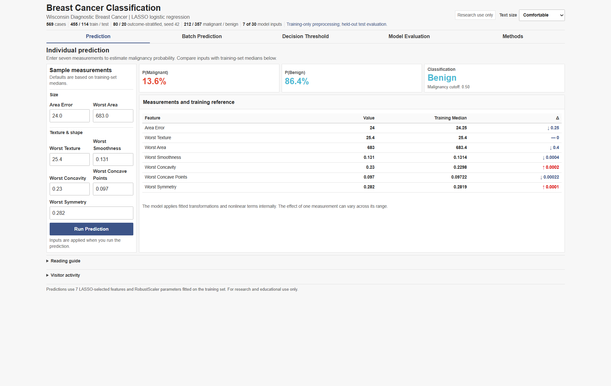

# Breast Cancer Classification Dashboard

An interactive [Shiny for Python](https://shiny.posit.co/py/) dashboard for breast cancer classification using a two-stage LASSO and unpenalized logistic-regression workflow.

[Open the live application](https://medictio.shinyapps.io/breast-cancer-classifier/)

> [!WARNING]
> This project is intended for research, education, and software demonstration only. It is not a medical device, has not been externally validated, and must not be used to diagnose patients or guide treatment.

## Application preview



## Overview

The application uses the [Wisconsin Diagnostic Breast Cancer dataset](https://archive.ics.uci.edu/dataset/17/breast-cancer-wisconsin-diagnostic), distributed through `sklearn.datasets.load_breast_cancer`. The dataset contains 569 samples and 30 continuous measurements derived from digitized fine-needle aspirate images of breast masses.

The dashboard provides:

- single-case prediction with editable feature values;
- estimated probabilities for the malignant and benign classes;
- batch CSV scoring and export;
- interactive decision-threshold analysis;
- train/test ROC, calibration, and classification metrics;
- LASSO paths, selected coefficients, linearity checks, and VIF diagnostics;
- a global visitor map with aggregate usage statistics; and
- a deployment-safe precomputed model bundle without raw feature matrices.

## Model workflow

```text
Wisconsin Diagnostic Breast Cancer data (n = 569, 30 features)
                         |
             80/20 stratified split
                random seed = 42
                         |
        RobustScaler fitted on training data only
                         |
       L1 logistic regression, 5-fold CV by AUC
          lambda-1SE rule for feature selection
                         |
              7 retained predictors
                         |
     Training-only transformations and cubic splines
          28 design terms from the 7 inputs
                         |
        Robust scaling and unpenalized logistic refit
                         |
       Saved bundle -> Shiny prediction dashboard
```

The tracked bundle was fitted on 455 training observations and evaluated on 114 held-out observations. RobustScaler is fitted separately in every LASSO cross-validation fold. Transformation screening, spline knots, final scaling, and coefficient estimation use the training split only. LASSO tuning scores do not validate the final model after functional-form selection and refitting.

The prespecified GAM effective-degrees-of-freedom rule selects a 3-knot cubic spline for each retained input. `area error` and `worst texture` first use `log1p`; `worst concavity` uses Yeo-Johnson; the remaining inputs use their original scale before spline construction. These seven inputs expand to 28 design terms. GAM smooth p-values are approximate association tests, not tests of nonlinearity; spline-versus-linear LRT results are recorded separately in `eda_decisions.json`.

### Selected predictors

The current `bc_bundle.pkl` retains seven of the original 30 predictors:

1. `area error`
2. `worst texture`
3. `worst area`
4. `worst smoothness`
5. `worst concavity`
6. `worst concave points`
7. `worst symmetry`

All inputs must use the units and definitions of the original Wisconsin Diagnostic Breast Cancer dataset.

## Probability semantics

The class encoding is important:

| Encoded class | Meaning |
|---:|---|
| `0` | Malignant |
| `1` | Benign |

Consequently, `pipe_lr.predict_proba(X)[:, 1]` is `P(benign)`. The application reports malignancy probability as:

```python
p_benign = pipe_lr.predict_proba(X)[:, 1]
p_malignant = 1.0 - p_benign
```

At the default threshold, a case is classified as malignant when `P(malignant) >= 0.50`. The Decision Threshold tab allows this operating cutoff to be explored interactively.

## Current bundle performance

The following values describe the checked-in bundle and its fixed 80/20 split. They are not estimates of performance in a new clinical population.

| Metric | Train | Test |
|---|---:|---:|
| ROC AUC | 0.999 | 0.991 |
| Brier score | 0.0057 | 0.0464 |
| Accuracy at 0.50 | 0.993 | 0.947 |

Test-set classification at `P(malignant) >= 0.50`:

| Metric | Value |
|---|---:|
| Accuracy | 0.947 |
| Sensitivity for malignancy | 0.976 |
| Specificity for benign cases | 0.931 |
| Positive predictive value | 0.891 |
| Negative predictive value | 0.985 |
| F1 score for malignancy | 0.932 |

The test-set confusion matrix contains 41 true positives, 67 true negatives, 5 false positives, and 1 false negative when malignancy is treated as the positive class. The test Brier score is 0.0464 versus 0.2327 for the training-prevalence null model. The grouped Hosmer-Lemeshow statistic is 2589.47 with 5 degrees of freedom and `p < 0.001`. Extreme predicted probabilities and sparse expected counts make that asymptotic test unreliable; the train/test Brier difference and calibration curves also show a calibration concern. The test set was not used to select a replacement model or tune its settings.

### Model evaluation figures

The figures below are rendered from the checked-in `bc_bundle.pkl`, so they correspond to the same fixed train/test split and fitted model reported above. They use the shared Cell red/blue/teal palette with navy typography and can be regenerated with `python generate_readme_figures.py`.

#### Discrimination, calibration, and fitted coefficients

Panel A compares the train and held-out test ROC curves. Panel B shows train/test calibration and Brier scores. Panel C shows the 28 fitted spline-basis coefficients after robust scaling. Individual basis coefficients are not raw-input effects; their joint contribution defines each input's fitted curve.


#### LASSO feature selection

Panel A shows the regularization paths, and Panel B shows the five-fold cross-validation AUC used by the lambda-1SE selection rule.


#### Functional-form diagnostics

Empirical training-set log-odds, GAM curves with 95% intervals, and linear references are shown for each retained predictor. On the selected transformation scale, LRTs flag `worst texture`, `worst concavity`, and `worst symmetry` at `alpha = 0.10`. The applied forms follow the separately documented GAM rule.


#### Collinearity diagnostics

Variance inflation factors are shown for the seven raw retained inputs, with reference lines at VIF 5 and VIF 10. The application Methods table additionally reports VIF for all 28 design terms; within-variable spline bases are strongly correlated.


## Run locally

Use Python 3.13 (the bundles and deployment use Python 3.13.9).

```bash
git clone https://github.com/MUQING-research/breast-cancer-risk-app.git
cd breast-cancer-risk-app

python -m venv .venv
```

Activate the environment:

```powershell
# Windows PowerShell
.venv\Scripts\Activate.ps1
```

```bash
# macOS or Linux
source .venv/bin/activate
```

Install the runtime dependencies and start the app:

```bash
python -m pip install --upgrade pip
python -m pip install -r requirements.txt
shiny run --reload app.py
```

Open the local URL printed by Shiny, normally `http://127.0.0.1:8000`.

The app loads `bc_bundle.pkl` at startup. Keep that file beside `breast_cancer_app.py` when packaging or deploying the application.

For an offline rebuild, install `pygam==0.12.0` and `statsmodels==0.14.5`, then run `python rebuild_bundle.py`. The training helper exports the cleaned table, dictionary, diagnostic PNGs, design matrices, and decision log into `.cache/training/`. These local row-level exports are excluded from deployment and Git. Reproduce the runtime checks with `python -m unittest test_model_contract -v`.

## Batch prediction

Upload a CSV containing all seven retained feature columns. Additional columns are preserved in the downloaded result.

```csv
area error,worst texture,worst area,worst smoothness,worst concavity,worst concave points,worst symmetry
```

The exported file appends:

- `P_malignant`
- `P_benign`
- `Prediction`

Column names are case-sensitive. The interface checks required columns, numeric types, finite values, non-negative measurements, and empty uploads. Users must still verify measurement units and data provenance.

## Deployment

The repository includes a shinyapps.io deployment helper:

```bash
python -m pip install rsconnect-python
python deploy.py
```

Configure `rsconnect` credentials before running the helper from the Python 3.13 environment matching `requirements.txt`. Run `python deploy.py --check` for a local preflight. The helper updates the existing `medictio/breast-cancer-classifier` app, checks pinned package versions, and uploads only the runtime file allowlist, including the precomputed bundle and stylesheet.

For any alternative container or hosting workflow, package at least:

- `app.py`
- `breast_cancer_app.py`
- `bc_bundle.pkl`
- `eda_decisions.json`
- `requirements.txt`
- `theme.css`
- `world.geojson` if the visitor map is enabled

Do not replace the deployment bundle with raw training records. The tracked bundle contains fitted estimators, preprocessing statistics, predictions, outcome labels, metrics, and plot data, but no `X_train`, `X_test`, or full patient-level feature table.

## Optional visitor analytics

The dashboard can optionally render aggregate visit statistics through Supabase and locate public IP addresses through IPinfo or the `ipwho.is` fallback. Remote persistence requires both `SUPABASE_URL` and `SUPABASE_KEY`; without them, the app uses a bounded process-local visit list that resets on restart. Hosted visitors should be informed when location lookup is enabled.

The shinyapps.io deployment helper does not forward environment variables: that platform does not support `rsconnect --environment` management. Container hosts can inject the variables below. See the [Posit deployment documentation](https://docs.posit.co/rsconnect-python/deploying/).

The application code does not persist prediction form values or uploaded CSV contents. Analytics settings are supplied through environment variables:

| Environment variable | Purpose |
|---|---|
| `IPINFO_TOKEN` | Optional authenticated IPinfo lookup |
| `SUPABASE_URL` | Supabase project URL |
| `SUPABASE_KEY` | Supabase client key; access should be restricted with row-level security |

## Repository layout

```text
.
|-- app.py                 # Minimal Shiny entry point
|-- breast_cancer_app.py   # Model loading, UI, server, plots, and analytics
|-- bc_bundle.pkl          # Precomputed model and evaluation bundle
|-- eda_decisions.json     # Training-only preprocessing decisions and provenance
|-- rebuild_bundle.py     # Offline training and local audit exports
|-- training_eda.py       # Training-only transformation and functional-form screening
|-- test_model_contract.py # Regression tests for the model and data contract
|-- theme.css             # Active application stylesheet
|-- generate_readme_figures.py  # Reproducible README figure generator
|-- assets/                # Application screenshot and model figures used in this README
|-- requirements.txt       # Runtime dependencies
|-- deploy.py              # shinyapps.io deployment helper
|-- Dockerfile             # Container definition
|-- upload.py              # Hugging Face Space upload helper
`-- world.geojson          # Basemap used by visitor analytics
```

## Limitations

- The model is trained on a small, classic benchmark dataset rather than a contemporary prospective cohort.
- Performance is reported from one stratified holdout split; there is no nested validation, external validation, temporal validation, or site-level validation.
- The dataset does not represent the full clinical diagnostic pathway, prevalence, spectrum of disease, acquisition variability, or downstream consequences of errors.
- The flexible unpenalized spline refit has near-perfect apparent discrimination and a substantial train/test calibration gap. High AUC does not establish reliable absolute probabilities.
- VIF is moderate for raw `worst area` and `worst concave points`, and substantially larger for correlated spline basis terms. Individual basis coefficients should not be interpreted as raw-input effects.
- The default threshold is illustrative and has not been selected from clinical costs, decision-curve analysis, or a prespecified deployment population.

## Data attribution

Wolberg, W., Mangasarian, O., Street, N., and Street, W. (1993). *Breast Cancer Wisconsin (Diagnostic)* [Dataset]. UCI Machine Learning Repository. [https://doi.org/10.24432/C5DW2B](https://doi.org/10.24432/C5DW2B)

The scikit-learn loader is documented at [`sklearn.datasets.load_breast_cancer`](https://scikit-learn.org/stable/modules/generated/sklearn.datasets.load_breast_cancer.html).
